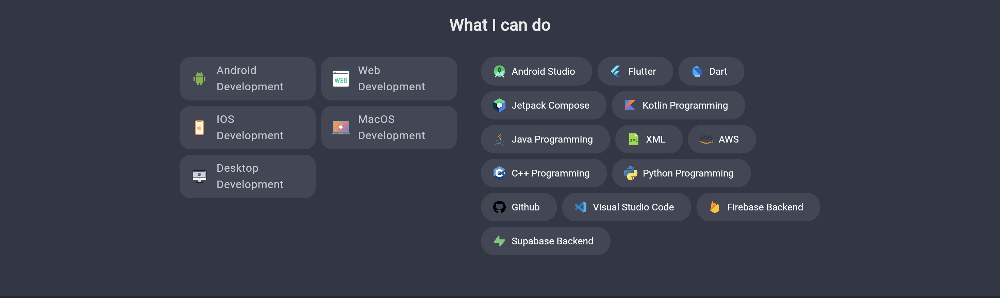
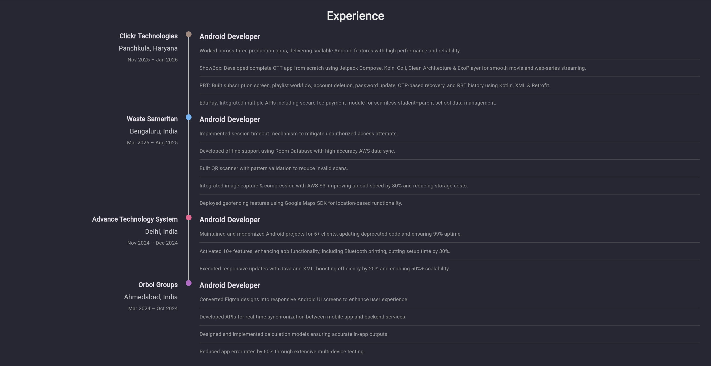
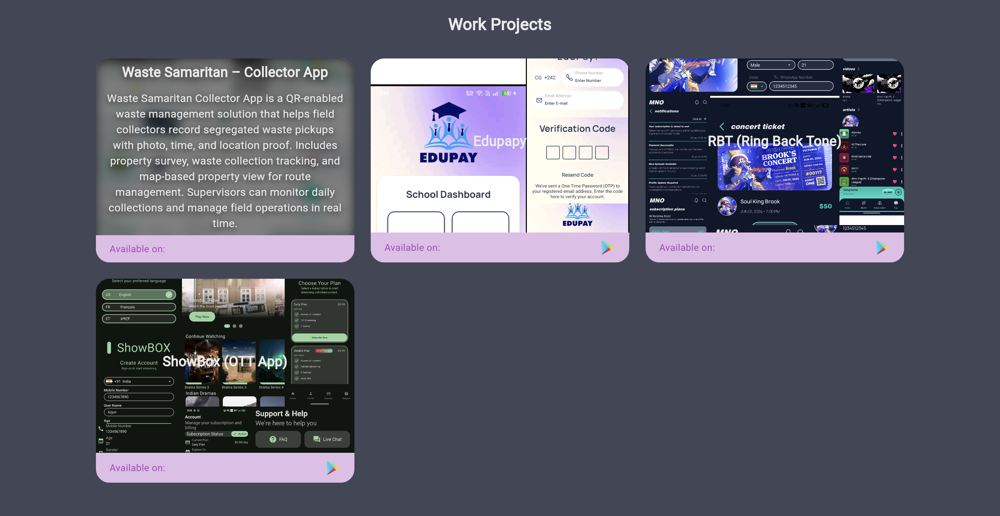
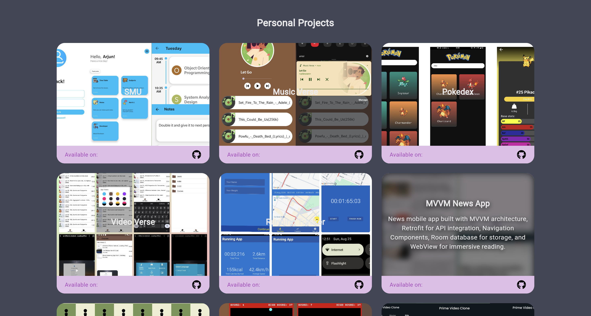
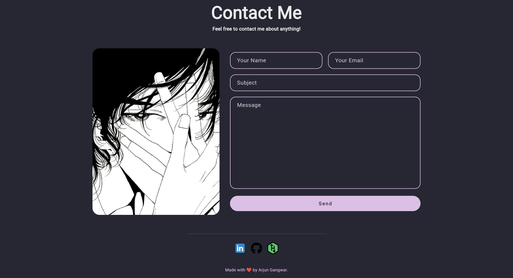

# PortfolioFlutter

A **cross-platform personal developer portfolio** built using **Flutter**, designed to run seamlessly on **Android, iOS, and Web**.

This project focuses on **UI composition, responsive layouts, theming, and navigation**, serving as a clean showcase of Flutter fundamentals and design consistency across platforms.

---

## 📸 Screenshots

| About | Skills | Experience |
|------|------|-----------|
|  |  |  |

| Work Projects | Personal Projects | Contact |
|-------------|-------------|---------|
|  |  |  |

## 🚀 Key Features

- 🧑‍💻 **Personal Portfolio Sections**
  - About Me
  - Skills & Technologies
  - Projects showcase
  - Contact & social links

- 📱 **Cross-Platform Support**
  - Single codebase for Android, iOS, and Web
  - Consistent UI and behavior across platforms

- 🎨 **Clean & Consistent UI**
  - Structured widget composition
  - Reusable UI components
  - Centralized styling and theming

- 🧭 **Navigation Flow**
  - Multi-screen navigation
  - Clear separation of sections
  - Smooth user flow between pages

- 📐 **Responsive Layouts**
  - Adaptive UI for different screen sizes
  - Web and mobile friendly layouts

---

## 🏗 Architecture Overview

The project follows a **UI-focused, layered Flutter structure**, prioritizing readability, reuse, and maintainability.
```markdown
lib/
├── core/
│ ├── constants/
│ ├── theme/
│ └── utils/
├── presentation/
│ ├── screens/
│ ├── widgets/
│ └── navigation/
└── main.dart
```

### Architectural Highlights
- Separation between **screens** and **reusable widgets**
- Centralized theme and constants
- Scalable structure for adding new sections or pages

---

## 🛠 Tech Stack

- **Flutter / Dart**
- **UI Framework**: Material Design
- **Navigation**: Flutter Navigator
- **Architecture**: Layered UI architecture
- **Platform Support**: Android, iOS, Web

---

## ▶️ Getting Started

```bash
flutter pub get
flutter run
```
